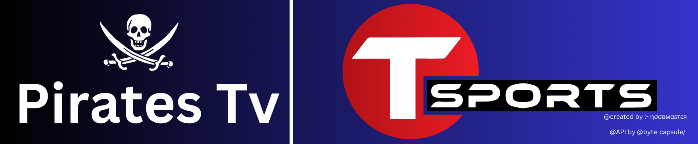
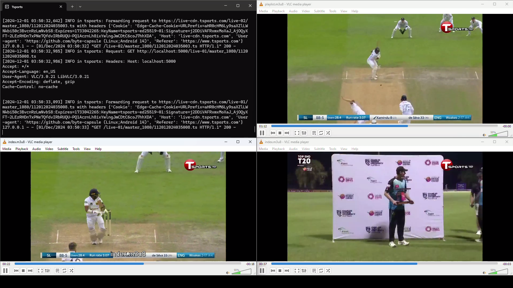

<h1 align="center">
  <br>
  <a href="https://play.google.com/store/apps/details?id=com.nex.tsports&hl=en"></a>
  
  <br>
  Tsports Windows

  <br>
     
     

</h1>
<p align="center">
  
  <a href="https://gitter.im/amitmerchant1990/electron-markdownify">
    
  </a>
  <a href="https://hits.seeyoufarm.com"></a>
  <a href="https://www.python.org/">
    
 </a>

## Authors

- [@FunctionError](https://github.com/FunctionError/)

## Contents

- [Requirement](#requirement)

- [Playlist](#playlist)

- [How to use ?](#how-to-use)

- [Credits](#credits)

- [Legal](#legal)

- [License](#license)



# Requirement

- [Tsports EXE](https://github.com/FunctionError/Tsports/raw/refs/heads/main/Tsports.exe) - Only works for Windows users.

- [VLC for Android](https://play.google.com/store/apps/details?id=org.videolan.vlc) - Free and open-source portable cross-platform media player.

- [Native MPEG-Dash + HLS Playback](https://chromewebstore.google.com/detail/native-mpeg-dash-+-hls-pl/cjfbmleiaobegagekpmlhmaadepdeedn) - Native HLS Playback for Chrome is a free extension that allows you to play HLS video URLs (also known as m3u8) "natively" on your browser.

# PLAYLIST

## Tsports UPDATED M3U FILE (Only works in localhost)

```bash
  https://tsportsforwindows.piratestv.workers.dev/
```
# Note !

- Make sure you are from Bangladesh.

- And if ProxyFire is on, then please close ProxyFire.

# How to use ?

- **COPY  [PLAYLIST](#playlist)**

- [Tsports EXE](https://github.com/FunctionError/Tsports/raw/refs/heads/main/Tsports.exe) - **Download and run this small Python-based software to restream Tsports**
- [VLC for Windows](https://www.videolan.org/vlc/download-windows.html) - **Open VLC player**

- **CTRL + V (or go to stream option)**

# Credits

- [TSports-m3u8-Grabber](https://github.com/byte-capsule/TSports-m3u8-Grabber) - This project is fully dependent on this Repository.

# Legal

No video files are stored in this repository. This repository has been created for educational purposes only. It includes links to publicly available streaming links found directly on the internet, making them easily accessible to users. If any link infringes on your copyright, it may be removed by submitting a pull request or opening an issue. However, please note that we have no control over the content at the destination of the link, and removing the link will not delete the content from the web. Sharing links does not directly infringe copyright, as no copy is made here; therefore, it is not a valid reason for issuing a DMCA notice to GitHub. To remove this content from the web, you need to contact the web host that is actually hosting the content (neither GitHub nor the maintainers of this repository).

# **License**

[](LICENSE)
